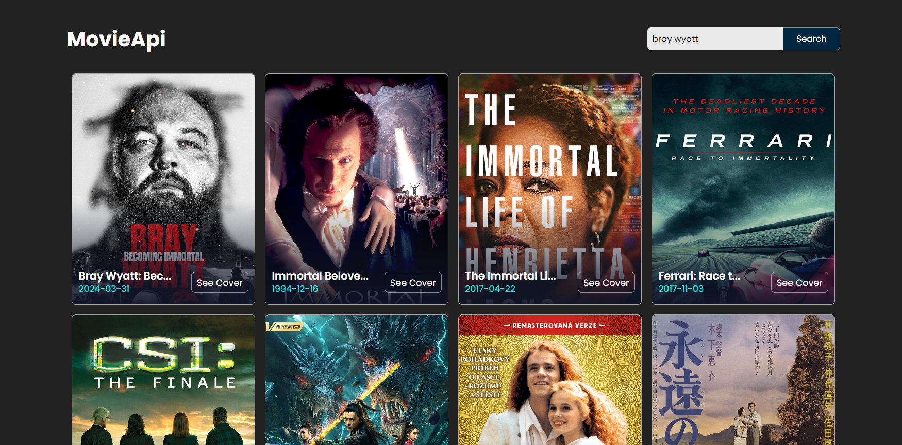

## Movie App (TheMovieDB)

In this project we designed a Movie App using JavaScript. 
In this video we used TheMovieDB api to get movie information. 
Also this code is fully responsive and will load more results when you scroll.

This project is a movie app clone project! 
The project also includes changes in css and js codes and design according to my personal taste.

You can reach my LinkedIn profile [here](https://www.linkedin.com/in/enesseri).

## Screenshot
A screenshot of the project is given below.

