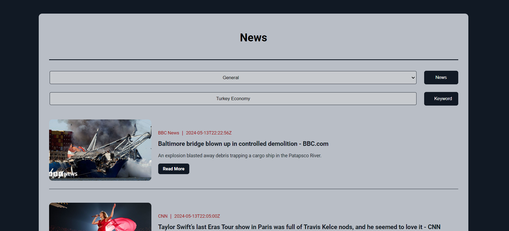

# News Live API

This project is a simple global news search and uses a live API.

## How to Use

1. Clone the project to your computer.
2. Open your internet browser and navigate to the directory where the project is located.
3. Open the `index.html` file.
4. Select the necessary options and complete the process.

## Contribution

1. Fork this project.
2. Add new features or make bug fixes.
3. Submit a pull request for your changes.

## Screenshot

