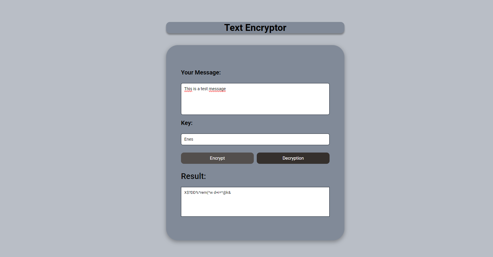

# Text Encryptor

This project includes a simple text encryptor and decryptor. It encrypts texts using a specific encryption algorithm and then uses the same algorithm to decrypt these encrypted texts.

## How to Use

1. Clone the project to your computer.
2. Open your internet browser and navigate to the directory where the project is located.
3. Open the `index.html` file.
4. Once the Text Encryptor application is loaded, enter the text you want to encrypt or decrypt.
5. Select the necessary options and complete the process.

## Encryption Algorithms

The following encryption algorithms can be used in this project:

- **Caesar Cipher:** Encrypts and decrypts texts by shifting them according to a key number.
- **Vigenère Cipher:** Encrypts and decrypts texts using a keyword.

## Contribution

1. Fork this project.
2. Add new features or make bug fixes.
3. Submit a pull request for your changes.

# Linkedin My Profile

You can reach my LinkedIn profile [here](https://www.linkedin.com/in/enesseri).

## Screenshot

